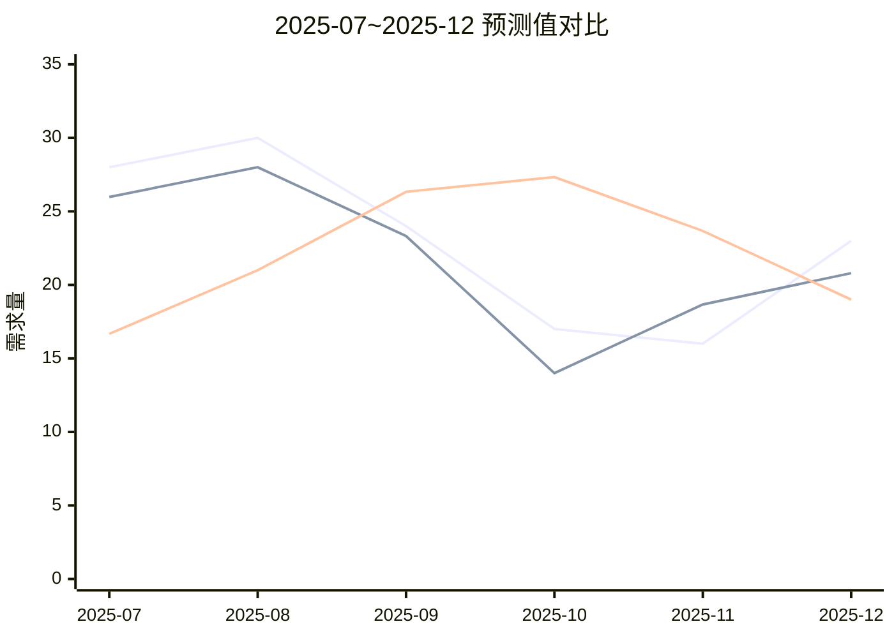

# RF 与 SMA(3) 预测对比实验报告

最后更新: 2026-03-26
实验来源: ../../archive/legacy_sources/ai8.md, ../../archive/legacy_sources/ai9.md, ../../archive/legacy_sources/随机森林.md

---

## 1. 实验目的

验证在当前备件需求序列下，随机森林（RF）是否优于简单移动平均（SMA(3)）。

判定原则：
1. MAE 更低
2. RMSE 更低
3. MAPE 更低
4. 月度胜率更高

---

## 2. 评估口径

- 样本: SP20001
- 历史窗口: 2025-01 ~ 2025-12
- 测试窗口: 2025-07 ~ 2025-12（6 个月）
- 对比方法:
  - RF: 滚动训练逐月预测
  - SMA(3): 前 3 个月实际值均值

---

## 3. 月度对比明细

| 月份 | 实际需求 | RF预测 | SMA(3)预测 | RF绝对误差 | SMA绝对误差 | RF是否更优 |
|---|---:|---:|---:|---:|---:|---:|
| 2025-07 | 28.00 | 25.98 | 16.67 | 2.02 | 11.33 | 是 |
| 2025-08 | 30.00 | 28.00 | 21.00 | 2.00 | 9.00 | 是 |
| 2025-09 | 24.00 | 23.32 | 26.33 | 0.68 | 2.33 | 是 |
| 2025-10 | 17.00 | 14.00 | 27.33 | 3.00 | 10.33 | 是 |
| 2025-11 | 16.00 | 18.67 | 23.67 | 2.67 | 7.67 | 是 |
| 2025-12 | 23.00 | 20.80 | 19.00 | 2.20 | 4.00 | 是 |

---

## 4. 汇总指标

| 指标 | RF | SMA(3) |
|---|---:|---:|
| MAE | 2.10 | 7.44 |
| RMSE | 2.22 | 8.13 |
| MAPE | 10.10% | 34.38% |
| 月度胜率 | 100.00% | 0.00% |

结论：
- RF 在 4 项关键指标上全部优于 SMA(3)
- 测试窗口内月度胜率为 `6/6`

---

## 5. 可视化（Mermaid）

### 5.1 预测值对比

### 5.2 绝对误差对比

```mermaid
xychart-beta
    title "2025-07~2025-12 绝对误差对比"
    x-axis ["2025-07","2025-08","2025-09","2025-10","2025-11","2025-12"]
    y-axis "绝对误差" 0 --> 12
    bar "RF绝对误差" [2.02,2.00,0.68,3.00,2.67,2.20]
    bar "SMA(3)绝对误差" [11.33,9.00,2.33,10.33,7.67,4.00]
```

---

## 6. 结果解释

为何 RF 在该窗口表现更优：
1. 能利用更多特征（月份、区间宽度、上下界等），不只看短窗口均值
2. 对非平稳序列的适应性更好
3. 对突变月份（如 2025-10）误差控制明显优于 SMA(3)

可能风险：
1. 小样本下仍有过拟合风险
2. 若特征质量下降，RF 优势会减弱

---

## 7. 生产使用建议

建议策略：
1. 默认使用 RF 作为主算法
2. 当历史有效样本不足时自动回退到 SMA/Fallback
3. 每月回测 MAE、MAPE，超过阈值自动告警

建议阈值（可调整）：
- `MAPE > 25%` 触发模型质量告警
- 连续 2 个月胜率 < 50% 触发回退评估

---

## 8. 关联文档

- 算法总览: [../SUMMARY.md](../SUMMARY.md)
- 预测实现: [../FORECASTING.md](../FORECASTING.md)
- 安全库存: [../SAFETY_STOCK.md](../SAFETY_STOCK.md)

---

维护人: AI 算法团队
版本: 1.0
