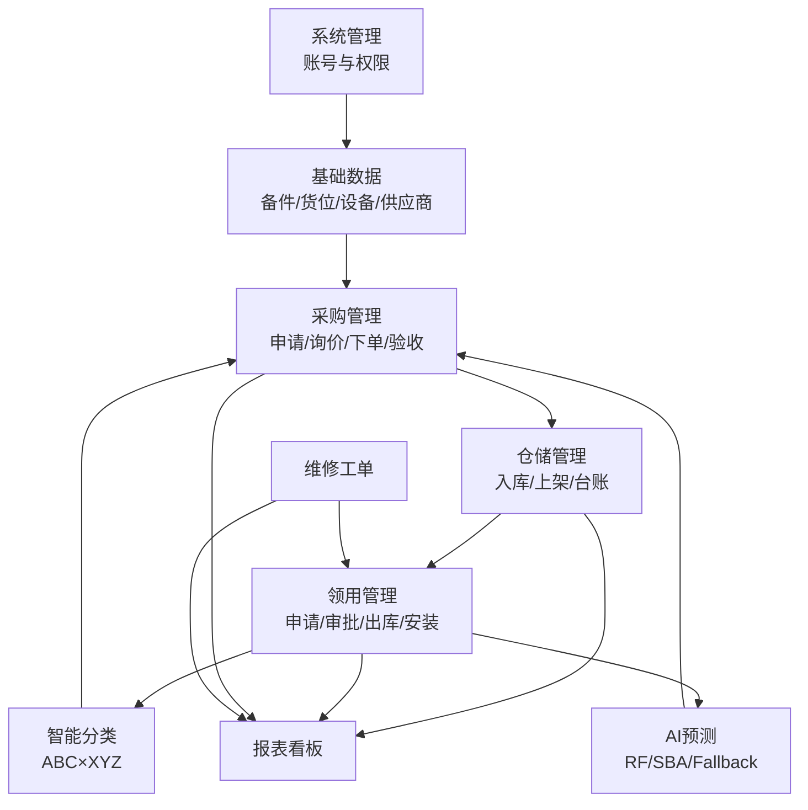
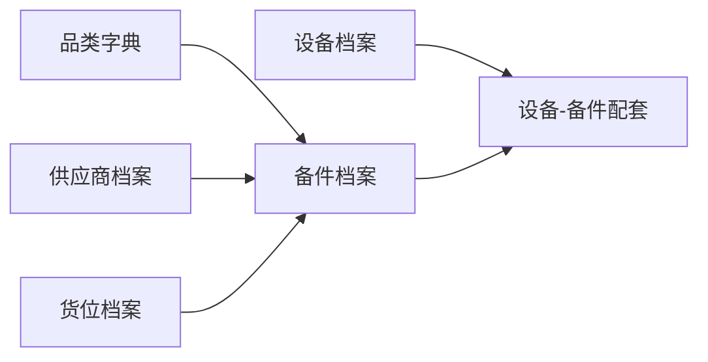

# 模块详细流程说明

最后更新: 2026-03-26
范围: 备件管理系统 9 大模块的业务流程与联动关系

---

## 1. 目标与阅读方式

本文档用于补齐架构层面的“流程细节”，重点说明：
- 每个模块内部流程节点
- 与其他模块的输入输出关系
- 关键状态与数据落点

建议配合 [SYSTEM_OVERVIEW.md](SYSTEM_OVERVIEW.md) 一起阅读：
- 先看总览，再看本文细节

---

## 2. 全链路主流程

---

## 3. 模块详细流程

## 3.1 系统管理

主要目标：提供统一身份与权限控制。

流程：
1. 创建用户账号
2. 创建角色并配置菜单权限
3. 用户绑定角色
4. 登录后按角色下发可见菜单与接口权限

关键数据：
- `sys_user`
- `sys_role`
- `sys_menu`

输出：
- 所有业务模块的访问控制上下文

---

## 3.2 基础数据管理

主要目标：维护所有业务模块的主数据。

流程：
1. 建立品类字典
2. 建立供应商档案并绑定供货品类
3. 建立货位档案（仓区、容量）
4. 建立备件档案（编码、价格、提前期）
5. 建立设备档案并维护设备-备件配套关系

关键数据：
- `spare_part`
- `supplier`
- `location`
- `equipment`

输出：
- 采购、仓储、领用、工单模块可引用的主数据

---

## 3.3 仓储管理

主要目标：实现入库到出库前的库存可视化管理。

流程：
1. 采购到货后执行入库收货
2. 创建/更新批次记录，写入 `stock_in_item`
3. 执行货位上架，建立货位库存映射
4. 更新总库存快照 `spare_part_stock`
5. 台账查询与预警输出

关键规则：
- 批次剩余量与总库存必须一致
- 批次支持 FIFO 出库扣减

关键数据：
- `stock_in_item`
- `spare_part_stock`

输出：
- 领用模块可用库存
- 报表模块库存数据

---

## 3.4 领用管理

主要目标：从申请到安装登记形成完整领用闭环。

流程：
1. 申请人创建领用单与明细
2. 审批人执行通过/驳回
3. 仓库执行出库（调用 FIFO 扣减）
4. 记录安装位置与安装时间
5. 状态推进到完成

关键数据：
- `biz_requisition`
- `biz_requisition_item`
- `biz_outbound_batch_trace`

输出：
- 消耗历史（供 AI 与分类）
- 出库明细（供报表）

---

## 3.5 维修工单

主要目标：设备故障处理和维修成本沉淀。

流程：
1. 报修创建工单
2. 派工到维修人员
3. 维修过程记录（含备件更换）
4. 完工确认与费用记录

关键联动：
- 维修用料通过领用模块出库
- 费用数据进入报表模块

关键数据：
- `biz_work_order`
- `biz_work_order_item`

输出：
- 维修费用与工时统计

---

## 3.6 采购管理

主要目标：从补货建议到到货验收的采购闭环。

流程：
1. 根据库存、ROP、预测结果生成补货建议
2. 发起采购申请
3. 询价比价确定供应商
4. 下发采购订单并跟踪状态
5. 到货验收后触发仓储入库

关键数据：
- `biz_purchase_order`
- `biz_purchase_item`

输出：
- 仓储入库触发信号
- 供应商绩效数据

---

## 3.7 备件智能分类（ABC×XYZ）

主要目标：按重要性与波动性分层管理库存策略。

流程：
1. 读取最近 12 个月消耗
2. 计算金额占比并划分 ABC
3. 计算 ADI/CV² 并划分 XYZ
4. 生成 9 宫格分类结果
5. 输出 SS/ROP 策略参数

关键数据：
- `biz_part_classify`

输出：
- 采购策略参数
- AI 模型辅助特征

---

## 3.8 AI 智能分析

主要目标：生成未来需求预测和置信区间。

流程：
1. 汇总历史消耗至 `ai_forecast_data`
2. 根据数据形态选择算法：RF/SBA/Fallback
3. 输出预测值与上下界
4. 写入 `ai_forecast_result`
5. 提供给补货建议计算

关键数据：
- `ai_forecast_data`
- `ai_forecast_result`

输出：
- 预测需求量
- 预测区间上下界

---

## 3.9 报表与看板

主要目标：把多模块数据汇总成经营决策视图。

流程：
1. 抽取库存、消耗、工单、采购、分类数据
2. 计算 KPI 与趋势
3. 生成看板和明细报表
4. 发布预警列表

典型报表：
- 管理层 KPI
- 库存分析
- 消耗趋势
- 供应商绩效
- 维修费用
- 预警中心

---

## 4. 关键状态流

领用状态流：
- `DRAFT -> PENDING -> APPROVED -> OUTBOUND -> COMPLETED`

采购状态流：
- `DRAFT -> SUBMITTED -> CONFIRMED -> RECEIVED -> CLOSED`

工单状态流：
- `NEW -> ASSIGNED -> IN_PROGRESS -> COMPLETED`

---

## 5. 跨模块一致性检查

建议每日/每小时校验：
1. `spare_part_stock.quantity` 与批次剩余和一致
2. 已出库明细必须存在批次追溯记录
3. 预测结果月份不应重复写入
4. 分类结果需按月保持唯一

---

## 6. 与其它文档关系

- 架构全景: [SYSTEM_OVERVIEW.md](SYSTEM_OVERVIEW.md)
- FIFO 实现细节: [../IMPLEMENTATION/FIFO.md](../IMPLEMENTATION/FIFO.md)
- AI 预测与补货: [../AI_ALGORITHMS/FORECASTING.md](../AI_ALGORITHMS/FORECASTING.md)
- 数据库字段定义: [../DATABASE/DATA_MODEL.md](../DATABASE/DATA_MODEL.md)

---

维护人: AI 文档团队
版本: 1.0
