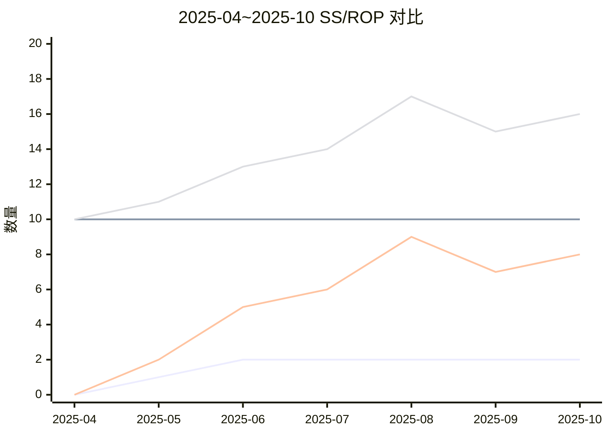

# 深沟球轴承（SP20001）安全库存方法对比实验报告

## 1. 实验目标与样本说明
本实验以 `SP20001（深沟球轴承）` 为样本，基于系统真实业务消耗数据，完成以下输出：
1. 安全库存计算输入参数表。
2. 动态安全库存法与固定安全库存法的 SS/ROP 计算逻辑。
3. 以 `2025-04`~`2025-10` 为验证集的实验对比表、对比图与结论。

---

## 2. 数据来源与验证集口径

### 2.1 数据来源
- 消耗数据：`biz_requisition_item.out_qty` + `biz_requisition.approve_time` + `spare_part`。
- 过滤条件：
  - `sp.code = 'SP20001'`
  - `r.req_status IN ('OUTBOUND','INSTALLED')`
  - `ri.out_qty > 0`

### 2.2 时间与补0规则
- 连续月轴：`2025-01`~`2025-10`。
- 若当月无消耗记录，按 `0` 补齐。
- 验证集：`2025-04`~`2025-10`（7个月）。

### 2.3 样本基础参数（库内快照）
- `part_code`: `SP20001`
- `part_name`: 深沟球轴承
- `lead_time_days`: `10`
- `is_critical`: `0`
- `price`: `45.50`
- `current_stock_snapshot`: `84`

---

## 3. 安全库存输入参数表
> 说明：去重后按“每个月一行”展示；`method_tag` 标记该行参数同时供 dynamic/fixed 两种方法使用。

| part_code | part_name | month | actual_demand_qty | rolling_forecast_qty | lead_time_days | service_factor_k | sigma_d_est | current_stock_snapshot | method_tag |
|---|---|---|---:|---:|---:|---:|---:|---:|---|
| SP20001 | 深沟球轴承 | 2025-04 | 4.00 | 0.00 | 10 | 1.28 | 0.0000 | 84 | dynamic/fixed |
| SP20001 | 深沟球轴承 | 2025-05 | 23.00 | 1.33 | 10 | 1.28 | 0.0629 | 84 | dynamic/fixed |
| SP20001 | 深沟球轴承 | 2025-06 | 3.00 | 9.00 | 10 | 1.28 | 0.3344 | 84 | dynamic/fixed |
| SP20001 | 深沟球轴承 | 2025-07 | 29.00 | 10.00 | 10 | 1.28 | 0.3067 | 84 | dynamic/fixed |
| SP20001 | 深沟球轴承 | 2025-08 | 13.00 | 18.33 | 10 | 1.28 | 0.3705 | 84 | dynamic/fixed |
| SP20001 | 深沟球轴承 | 2025-09 | 4.00 | 15.00 | 10 | 1.28 | 0.3569 | 84 | dynamic/fixed |
| SP20001 | 深沟球轴承 | 2025-10 | 25.00 | 15.33 | 10 | 1.28 | 0.3446 | 84 | dynamic/fixed |

参数意义：
- `part_code`：备件编码，用于唯一识别样本。
- `part_name`：备件名称，用于业务可读性展示。
- `month`：验证月（本实验为 2025-04~2025-10）。
- `actual_demand_qty`：该月真实消耗量（实际出库量汇总）。
- `rolling_forecast_qty`：以前3个月真实消耗均值得到的滚动预测量。
- `lead_time_days`：采购提前期（天），用于 SS/ROP 计算。
- `service_factor_k`：服务水平系数，影响动态安全库存大小。
- `sigma_d_est`：日需求标准差估计值（由前3个月波动推导）。
- `current_stock_snapshot`：当前库存快照（实验基准库存）。
- `method_tag`：该行参数适用的方法标签（dynamic/fixed 共用）。

---

## 4. SS/ROP 计算逻辑（动态 vs 固定）

## 4.1 动态安全库存法（本方法）
按当前系统思路落地，参数取本实验固定值：`L=10`, `k=1.28`。

1. `d_bar = rolling_forecast_qty / 30`
2. `sigma_d = std(last_3_month_demand) / 30`
3. `SS_dynamic = ceil(k * sigma_d * sqrt(L))`
4. `ROP_dynamic = ceil(d_bar * L + SS_dynamic)`

说明：本实验在无预测区间上下界输入时，采用 `last_3_month_demand` 标准差估计 `sigma_d`。

## 4.2 传统固定安全库存法
1. `SS_fixed = 10`
2. `ROP_fixed = ceil(d_bar * L + SS_fixed)`

---

## 5. 验证集实验对比表（2025-04~2025-10）

定义：
- `demand_error = |actual_demand - rolling_forecast_qty|`
- `covered_dynamic = 1{SS_dynamic >= demand_error}`
- `covered_fixed = 1{SS_fixed >= demand_error}`
- `shortage_dynamic = max(0, demand_error - SS_dynamic)`
- `shortage_fixed = max(0, demand_error - SS_fixed)`

| month | actual_demand | rolling_forecast | SS_dynamic | ROP_dynamic | SS_fixed | ROP_fixed | demand_error | covered_dynamic | covered_fixed | shortage_dynamic | shortage_fixed |
|---|---:|---:|---:|---:|---:|---:|---:|---:|---:|---:|---:|
| 2025-04 | 4.00 | 0.00 | 0 | 0 | 10 | 10 | 4.00 | 0 | 1 | 4.00 | 0.00 |
| 2025-05 | 23.00 | 1.33 | 1 | 2 | 10 | 11 | 21.67 | 0 | 0 | 20.67 | 11.67 |
| 2025-06 | 3.00 | 9.00 | 2 | 5 | 10 | 13 | 6.00 | 0 | 1 | 4.00 | 0.00 |
| 2025-07 | 29.00 | 10.00 | 2 | 6 | 10 | 14 | 19.00 | 0 | 0 | 17.00 | 9.00 |
| 2025-08 | 13.00 | 18.33 | 2 | 9 | 10 | 17 | 5.33 | 0 | 1 | 3.33 | 0.00 |
| 2025-09 | 4.00 | 15.00 | 2 | 7 | 10 | 15 | 11.00 | 0 | 0 | 9.00 | 1.00 |
| 2025-10 | 25.00 | 15.33 | 2 | 8 | 10 | 16 | 9.67 | 0 | 1 | 7.67 | 0.00 |

参数意义：
- `month`：验证集月份。
- `actual_demand`：该月真实消耗量。
- `rolling_forecast`：由前3个月均值得到的预测量。
- `SS_dynamic`：动态法计算得到的安全库存。
- `ROP_dynamic`：动态法补货触发点。
- `SS_fixed`：固定法安全库存（本实验固定为10）。
- `ROP_fixed`：固定法补货触发点。
- `demand_error`：`|actual_demand - rolling_forecast|`，作为需求偏差代理。
- `covered_dynamic`：动态法是否覆盖偏差（1=覆盖，0=未覆盖）。
- `covered_fixed`：固定法是否覆盖偏差（1=覆盖，0=未覆盖）。
- `shortage_dynamic`：动态法未覆盖缺口。
- `shortage_fixed`：固定法未覆盖缺口。

---

## 6. 实验对比图（Mermaid）

## 6.1 图A：月度 SS/ROP 对比图


## 6.2 图B：效果汇总对比图（coverage_rate / avg_SS / avg_shortage）

```mermaid
xychart-beta
    title "动态法 vs 固定法 效果汇总"
    x-axis ["coverage_rate(%)","avg_SS","avg_shortage"]
    y-axis "数值" 0 --> 60
    bar "dynamic" [0.00,1.57,9.38]
    bar "fixed" [57.14,10.00,3.10]
```


---

## 7. 指标汇总与结论

## 7.1 汇总指标
| method | coverage_rate | avg_SS | avg_shortage |
|---|---:|---:|---:|
| dynamic | 0.00% | 1.57 | 9.38 |
| fixed(SS=10) | 57.14% | 10.00 | 3.10 |

参数意义：
- `method`：对比方法（动态法 / 固定法）。
- `coverage_rate`：验证期内 `covered=1` 的月份占比，代表缺货风险覆盖能力。
- `avg_SS`：验证期平均安全库存，代表库存占用强度。
- `avg_shortage`：验证期平均未覆盖缺口，代表服务水平风险代理。

## 7.2 结论
1. 覆盖率：固定法（57.14%）显著高于动态法（0.00%）。
2. 库存占用：动态法平均SS更低（1.57 vs 10.00），占用更省。
3. 缺货风险代理：动态法平均短缺量更高（9.38 vs 3.10），服务水平明显劣于固定法。
4. 综合判断：在当前样本和该动态参数估计方式下，动态法偏“过低库存”，固定法在保障性上更稳。
5. 适用边界：本结论仅基于单备件且验证窗口7个月，适合作为该样本的运行对比，不应直接外推到全部备件。

---

## 8. 复现 SQL 与计算步骤附录（只读）

### 8.1 提取消耗月度序列 SQL
```sql
SELECT DATE_FORMAT(r.approve_time,'%Y-%m') AS m,
       SUM(ri.out_qty) AS qty
FROM biz_requisition_item ri
JOIN biz_requisition r ON ri.req_id = r.id
JOIN spare_part sp ON ri.spare_part_id = sp.id
WHERE sp.code = 'SP20001'
  AND r.req_status IN ('OUTBOUND','INSTALLED')
  AND ri.out_qty > 0
  AND r.approve_time >= '2025-01-01'
  AND r.approve_time < '2025-11-01'
GROUP BY DATE_FORMAT(r.approve_time,'%Y-%m')
ORDER BY m;
```

### 8.2 提取样本参数 SQL
```sql
SELECT sp.code, sp.name, sp.lead_time, sp.is_critical, sp.price,
       COALESCE(sps.quantity, sp.quantity, 0) AS current_stock
FROM spare_part sp
LEFT JOIN spare_part_stock sps ON sps.spare_part_id = sp.id
WHERE sp.code = 'SP20001';
```

### 8.3 计算步骤
1. 构建 `2025-01`~`2025-10` 连续月轴并补0。
2. 对每个验证月 `t`（2025-04~2025-10）取前3月实际值，计算：
   - `rolling_forecast_qty`
   - `std(last_3_month_demand)`
3. 按第4节公式计算动态法与固定法的 SS/ROP。
4. 按第5节定义计算 `demand_error / covered / shortage`。
5. 汇总 `coverage_rate / avg_SS / avg_shortage` 并绘图。
