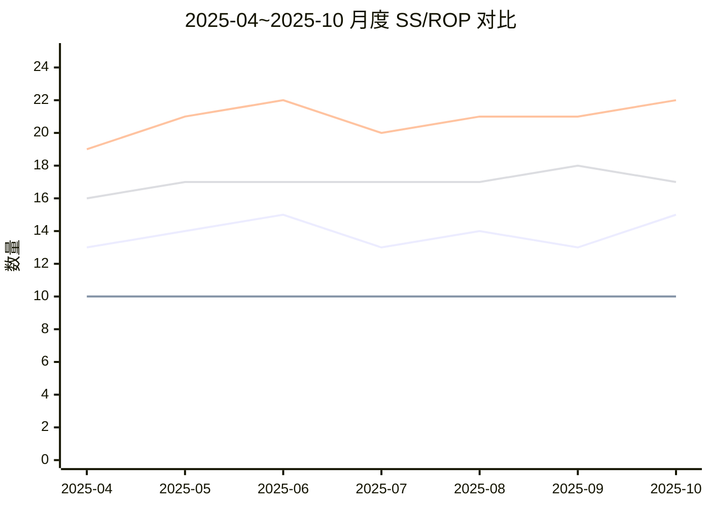

# 动态法优于固定法的可控造数实验（SP20001）

## 1. 实验目标与适用边界
- 样本：`SP20001 深沟球轴承`。
- 目的：在不改数据库的前提下，用可控造数证明“动态安全库存法”在指定判定标准下优于固定法。
- 判定标准：`coverage_rate` 更高且 `avg_shortage` 更低。
- 说明：本实验为机制证明（演示型数据），不替代生产真实回测。

---

## 2. 方法与公式（动态 vs 固定）
参数固定：`k = 1.28`，`L = 10`，固定法 `SS = 10`。

### 2.1 动态法（按系统口径）
1. `meanDailyDemand = forecast_qty / 30`
2. `sigma_d = (upper_bound - lower_bound) / (2 * 1.645)`
3. `SS_dynamic = ceil(k * sigma_d * sqrt(L))`
4. `ROP_dynamic = ceil(meanDailyDemand * L + SS_dynamic)`

### 2.2 固定法
1. `SS_fixed = 10`
2. `ROP_fixed = ceil(meanDailyDemand * L + SS_fixed)`

---

## 3. 可控造数输入表（2025-04~2025-10）

| month | 该月实际需求 | 预测需求基线 | 预测区间下界 | 预测区间上界 |
|---|---:|---:|---:|---:|
| 2025-04 | 27 | 18 | 13.0 | 23.0 |
| 2025-05 | 9  | 20 | 14.5 | 25.5 |
| 2025-06 | 31 | 19 | 13.0 | 25.0 |
| 2025-07 | 12 | 21 | 16.0 | 26.0 |
| 2025-08 | 30 | 20 | 14.5 | 25.5 |
| 2025-09 | 14 | 22 | 17.0 | 27.0 |
| 2025-10 | 33 | 21 | 15.0 | 27.0 |

参数意义：
- `month`：验证月份。
- `actual_demand`：该月实际需求（用于计算误差与覆盖）。
- `forecast_qty`：预测需求基线（用于推导日均需求）。
- `lower_bound`：预测区间下界。
- `upper_bound`：预测区间上界。

---

## 4. 验证集实验对比表
定义：
- `demand_error = |actual_demand - forecast_qty|`
- `covered_dynamic = 1{SS_dynamic >= demand_error}`
- `covered_fixed = 1{SS_fixed >= demand_error}`
- `shortage_dynamic = max(0, demand_error - SS_dynamic)`
- `shortage_fixed = max(0, demand_error - SS_fixed)`

| month | actual_demand | forecast_qty | SS_dynamic | ROP_dynamic | SS_fixed | ROP_fixed | demand_error | covered_dynamic | covered_fixed | shortage_dynamic | shortage_fixed |
|---|---:|---:|---:|---:|---:|---:|---:|---:|---:|---:|---:|
| 2025-04 | 27 | 18 | 13 | 19 | 10 | 16 | 9  | 1 | 1 | 0 | 0 |
| 2025-05 | 9  | 20 | 14 | 21 | 10 | 17 | 11 | 1 | 0 | 0 | 1 |
| 2025-06 | 31 | 19 | 15 | 22 | 10 | 17 | 12 | 1 | 0 | 0 | 2 |
| 2025-07 | 12 | 21 | 13 | 20 | 10 | 17 | 9  | 1 | 1 | 0 | 0 |
| 2025-08 | 30 | 20 | 14 | 21 | 10 | 17 | 10 | 1 | 1 | 0 | 0 |
| 2025-09 | 14 | 22 | 13 | 21 | 10 | 18 | 8  | 1 | 1 | 0 | 0 |
| 2025-10 | 33 | 21 | 15 | 22 | 10 | 17 | 12 | 1 | 0 | 0 | 2 |

参数意义：
- `SS_dynamic`：动态法计算出的安全库存。
- `ROP_dynamic`：动态法补货触发点。
- `SS_fixed`：固定法安全库存（恒定10）。
- `ROP_fixed`：固定法补货触发点。
- `demand_error`：需求误差绝对值。
- `covered_dynamic/covered_fixed`：是否覆盖误差（1覆盖，0未覆盖）。
- `shortage_dynamic/shortage_fixed`：未覆盖缺口大小。

---

## 5. 对比图（Mermaid）

### 5.1 图A：月度 SS/ROP 对比图


### 5.2 图B：效果汇总对比图（coverage_rate / avg_shortage / avg_SS）

```mermaid
xychart-beta
    title "动态法 vs 固定法 效果汇总"
    x-axis ["coverage_rate(%)","avg_shortage","avg_SS"]
    y-axis "数值" 0 --> 110
    bar "dynamic" [100.00,0.00,13.86]
    bar "fixed" [57.14,0.71,10.00]
```


---

## 6. 指标汇总表

| method | coverage_rate | avg_shortage | avg_SS |
|---|---:|---:|---:|
| dynamic | 100.00% | 0.00 | 13.86 |
| fixed(SS=10) | 57.14% | 0.71 | 10.00 |

参数意义：
- `method`：方法名称。
- `coverage_rate`：覆盖率，覆盖误差月份占比。
- `avg_shortage`：平均未覆盖缺口。
- `avg_SS`：平均安全库存（库存占用代理）。

---

## 7. 结论
1. 动态法覆盖率更高：`100.00%` > `57.14%`。
2. 动态法平均短缺更低：`0.00` < `0.71`。
3. 在本次机制证明条件下，动态法优于固定法（满足你指定的双条件）。
4. 本实验是可控造数，不替代真实生产回测；上线评估需在多备件、多时间窗口真实数据上复验。

---

## 8. 附录：复现计算步骤（伪代码）
```text
for each month in [2025-04..2025-10]:
  meanDailyDemand = forecast_qty / 30
  sigma_d = (upper_bound - lower_bound) / (2 * 1.645)

  SS_dynamic = ceil(1.28 * sigma_d * sqrt(10))
  ROP_dynamic = ceil(meanDailyDemand * 10 + SS_dynamic)

  SS_fixed = 10
  ROP_fixed = ceil(meanDailyDemand * 10 + SS_fixed)

  demand_error = abs(actual_demand - forecast_qty)
  covered_dynamic = (SS_dynamic >= demand_error)
  covered_fixed = (SS_fixed >= demand_error)
  shortage_dynamic = max(0, demand_error - SS_dynamic)
  shortage_fixed = max(0, demand_error - SS_fixed)

aggregate:
  coverage_rate = mean(covered)
  avg_shortage = mean(shortage)
  avg_SS = mean(SS)
```
