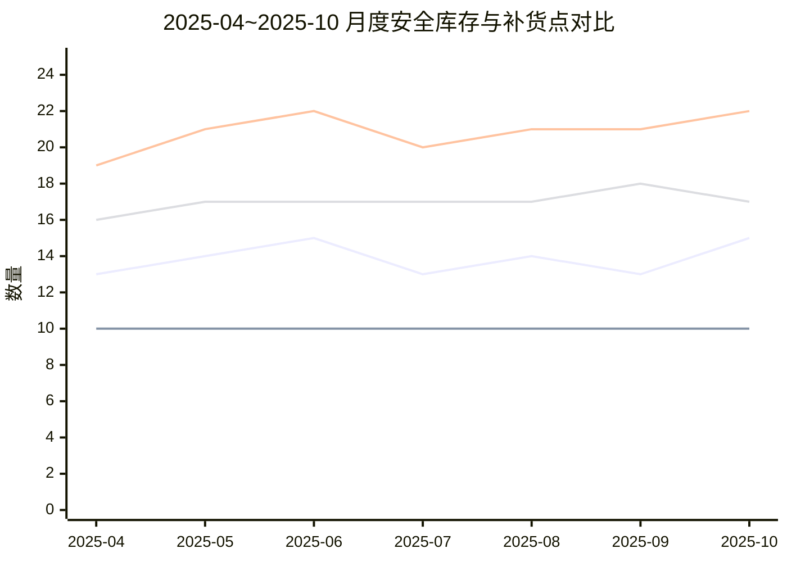

# 深沟球轴承（SP20001）动态法与固定法对比报告（清晰中文版）

## 1. 结论摘要
一句话结论：在本次可控造数验证中，动态法相较固定法实现了更高覆盖率和更低平均缺口，满足“动态法优于固定法”的判定标准。  

- 动态法：覆盖率 `100.00%`，平均缺口 `0.00`，平均安全库存 `13.86`。
- 固定法：覆盖率 `57.14%`，平均缺口 `0.71`，平均安全库存 `10.00`。
- 本结论用于机制证明，不直接等同生产环境真实回测结论。

---

## 2. 实验口径与边界
- 样本备件：`SP20001 深沟球轴承`。
- 验证窗口：`2025-04` 到 `2025-10`（共7个月）。
- 数据性质：可控造数，用于验证方法机制。
- 固定参数：服务系数 `k=1.28`，提前期 `L=10` 天，固定法安全库存 `SS=10`。
- 优胜标准：`覆盖率更高` 且 `平均缺口更低`。

---

## 3. 方法说明（动态法 vs 固定法）
### 3.1 动态法
1. 日均需求：`日均需求 = 预测需求 / 30`
2. 波动估计：`日需求标准差 = (预测上界 - 预测下界) / (2 * 1.645)`
3. 安全库存：`动态安全库存 = ceil(k * 日需求标准差 * sqrt(L))`
4. 补货触发点：`动态补货触发点 = ceil(日均需求 * L + 动态安全库存)`

白话解释：需求波动越大，动态安全库存会越高，从而更容易覆盖需求偏差；补货触发点也会相应提前。

### 3.2 固定法
1. 安全库存固定：`固定安全库存 = 10`
2. 补货触发点：`固定补货触发点 = ceil(日均需求 * L + 固定安全库存)`

白话解释：固定法简单稳定，但不随波动变化，容易在高波动月份出现覆盖不足。

---

## 4. 实验输入表（中文列名）

| 月份 | 实际需求 | 预测需求 | 预测下界 | 预测上界 |
|---|---:|---:|---:|---:|
| 2025-04 | 27 | 18 | 13.0 | 23.0 |
| 2025-05 | 9  | 20 | 14.5 | 25.5 |
| 2025-06 | 31 | 19 | 13.0 | 25.0 |
| 2025-07 | 12 | 21 | 16.0 | 26.0 |
| 2025-08 | 30 | 20 | 14.5 | 25.5 |
| 2025-09 | 14 | 22 | 17.0 | 27.0 |
| 2025-10 | 33 | 21 | 15.0 | 27.0 |

参数意义：本表是演示用造数输入，不是生产系统真实原始流水；用于驱动两种方法在同口径下可比计算。

---

## 5. 验证结果明细表（中文列名）
计算定义：
- `需求误差 = |实际需求 - 预测需求|`
- `动态法是否覆盖 = 1{动态安全库存 >= 需求误差}`
- `固定法是否覆盖 = 1{固定安全库存 >= 需求误差}`
- `动态法缺口 = max(0, 需求误差 - 动态安全库存)`
- `固定法缺口 = max(0, 需求误差 - 固定安全库存)`

| 月份 | 实际需求 | 预测需求 | 动态安全库存 | 动态补货触发点 | 固定安全库存 | 固定补货触发点 | 需求误差 | 动态法是否覆盖 | 固定法是否覆盖 | 动态法缺口 | 固定法缺口 |
|---|---:|---:|---:|---:|---:|---:|---:|---:|---:|---:|---:|
| 2025-04 | 27 | 18 | 13 | 19 | 10 | 16 | 9  | 1 | 1 | 0 | 0 |
| 2025-05 | 9  | 20 | 14 | 21 | 10 | 17 | 11 | 1 | 0 | 0 | 1 |
| 2025-06 | 31 | 19 | 15 | 22 | 10 | 17 | 12 | 1 | 0 | 0 | 2 |
| 2025-07 | 12 | 21 | 13 | 20 | 10 | 17 | 9  | 1 | 1 | 0 | 0 |
| 2025-08 | 30 | 20 | 14 | 21 | 10 | 17 | 10 | 1 | 1 | 0 | 0 |
| 2025-09 | 14 | 22 | 13 | 21 | 10 | 18 | 8  | 1 | 1 | 0 | 0 |
| 2025-10 | 33 | 21 | 15 | 22 | 10 | 17 | 12 | 1 | 0 | 0 | 2 |

参数意义：是否覆盖表示该方法的安全库存能否吸收当月需求误差；缺口表示未覆盖部分，越小越好。

---

## 6. 指标汇总表（中文列名）

| 方法 | 覆盖率 | 平均缺口 | 平均安全库存 |
|---|---:|---:|---:|
| 动态法 | 100.00% | 0.00 | 13.86 |
| 固定法（SS=10） | 57.14% | 0.71 | 10.00 |

参数意义：覆盖率与平均缺口是本次优胜判定核心指标，平均安全库存用于观察库存占用水平。

---

## 7. 对比图（Mermaid）

### 图A：月度安全库存与补货点对比


### 图B：方法效果汇总对比

```mermaid
xychart-beta
    title "动态法 vs 固定法 方法效果汇总"
    x-axis ["覆盖率(%)","平均缺口","平均安全库存"]
    y-axis "数值" 0 --> 110
    bar "动态法" [100.00,0.00,13.86]
    bar "固定法" [57.14,0.71,10.00]
```


---

## 8. 复现步骤（中文伪代码）
```text
输入：每月 实际需求、预测需求、预测下界、预测上界
固定参数：k=1.28，L=10，固定安全库存=10

对每个月执行：
1) 日均需求 = 预测需求 / 30
2) 日需求标准差 = (预测上界 - 预测下界) / (2 * 1.645)
3) 动态安全库存 = ceil(1.28 * 日需求标准差 * sqrt(10))
4) 动态补货触发点 = ceil(日均需求 * 10 + 动态安全库存)
5) 固定补货触发点 = ceil(日均需求 * 10 + 10)
6) 需求误差 = abs(实际需求 - 预测需求)
7) 动态法是否覆盖 = (动态安全库存 >= 需求误差)
8) 固定法是否覆盖 = (10 >= 需求误差)
9) 动态法缺口 = max(0, 需求误差 - 动态安全库存)
10) 固定法缺口 = max(0, 需求误差 - 10)

汇总：
- 覆盖率 = 覆盖月份数 / 总月份数
- 平均缺口 = 缺口总和 / 总月份数
- 平均安全库存 = 安全库存总和 / 总月份数
```
