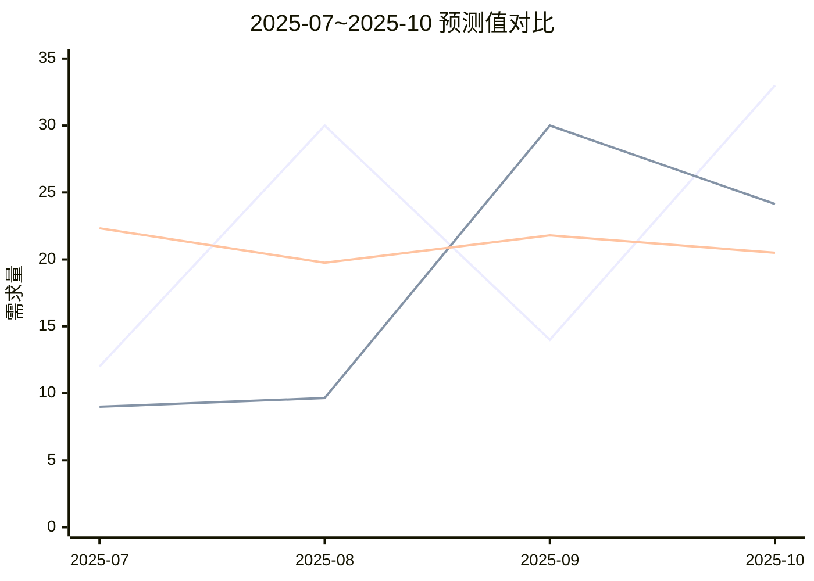

# 基于 ai7 数据的随机森林 vs 简单平均法对比（SP20001）

## 1. 实验说明
- 输入数据：直接使用 `ai7.md` 的 7 个月样本（2025-04 ~ 2025-10）。
- 对比方法：
  - 随机森林（RF）
  - 简单平均法（截至上月的历史实际需求均值）
- 评估方式：逐月滚动预测（从 2025-07 开始，使用此前月份数据预测当月）。
- 说明：这是小样本演示实验，结论仅针对该窗口。

## 2. 输入数据（来自 ai7）

| 月份 | 实际需求 | 预测需求 | 预测下界 | 预测上界 |
|---|---:|---:|---:|---:|
| 2025-04 | 27 | 18 | 13.0 | 23.0 |
| 2025-05 | 9  | 20 | 14.5 | 25.5 |
| 2025-06 | 31 | 19 | 13.0 | 25.0 |
| 2025-07 | 12 | 21 | 16.0 | 26.0 |
| 2025-08 | 30 | 20 | 14.5 | 25.5 |
| 2025-09 | 14 | 22 | 17.0 | 27.0 |
| 2025-10 | 33 | 21 | 15.0 | 27.0 |

参数意义：该表仅作为模型输入基础数据，实际评估以“实际需求”为真实值。

## 3. 模型与计算口径
### 3.1 随机森林（RF）
- 特征：`月份序号`、`预测需求`、`预测下界`、`预测上界`、`预测区间宽度`
- 参数：`RandomForestRegressor(n_estimators=500, max_depth=None, min_samples_leaf=1, bootstrap=False, random_state=42)`

### 3.2 简单平均法
- 公式：`当月预测 = 截至上月所有实际需求的平均值`

### 3.3 评估指标
- MAE、RMSE、MAPE
- 月度胜出判定：`RF绝对误差 < 平均法绝对误差`

## 4. 月度对比结果

| 月份 | 实际需求 | RF预测 | 简单平均预测 | RF绝对误差 | 平均法绝对误差 | RF相对误差(%) | 平均法相对误差(%) | RF是否更优 |
|---|---:|---:|---:|---:|---:|---:|---:|---:|
| 2025-07 | 12.00 | 9.00  | 22.33 | 3.00  | 10.33 | 25.00%  | 86.11% | 是 |
| 2025-08 | 30.00 | 9.65  | 19.75 | 20.35 | 10.25 | 67.84%  | 34.17% | 否 |
| 2025-09 | 14.00 | 30.00 | 21.80 | 16.00 | 7.80  | 114.29% | 55.71% | 否 |
| 2025-10 | 33.00 | 24.14 | 20.50 | 8.86  | 12.50 | 26.84%  | 37.88% | 是 |

参数意义：`RF是否更优` 用于标记该月 RF 是否比简单平均法误差更小。

## 5. 指标汇总

| 方法 | MAE | RMSE | MAPE |
|---|---:|---:|---:|
| 随机森林（RF） | 12.05 | 13.76 | 58.49% |
| 简单平均法 | 10.22 | 10.35 | 53.47% |

| 对比项 | 数值 |
|---|---:|
| RF更优月份占比 | 50.00% |

参数意义：MAE/RMSE/MAPE 越小越好；`RF更优月份占比` 表示 RF 在逐月对比中的胜率。

## 6. 可视化图（Mermaid）

### 图A：RF 与简单平均法绝对误差对比

```mermaid
xychart-beta
    title "2025-07~2025-10 绝对误差对比"
    x-axis ["2025-07","2025-08","2025-09","2025-10"]
    y-axis "绝对误差" 0 --> 22
    bar "RF绝对误差" [3.00,20.35,16.00,8.86]
    bar "平均法绝对误差" [10.33,10.25,7.80,12.50]
```

### 图B：月度预测值对比

## 7. 结论
- 在本次 `ai7` 7个月样本 + 滚动评估口径下，**简单平均法整体优于 RF**：
  - 简单平均法 MAE/RMSE/MAPE 均低于 RF。
  - RF 月度胜率为 50%。
- 解释：样本窗口很短、训练样本极少时，RF 容易不稳定；简单平均法在此类短序列场景更稳健。
- 若你要，我可以下一步按同样数据再给出 `SMA(3)`（3期移动平均）与 RF 的对比，通常比“累计平均”更贴近业务时间序列基线。
