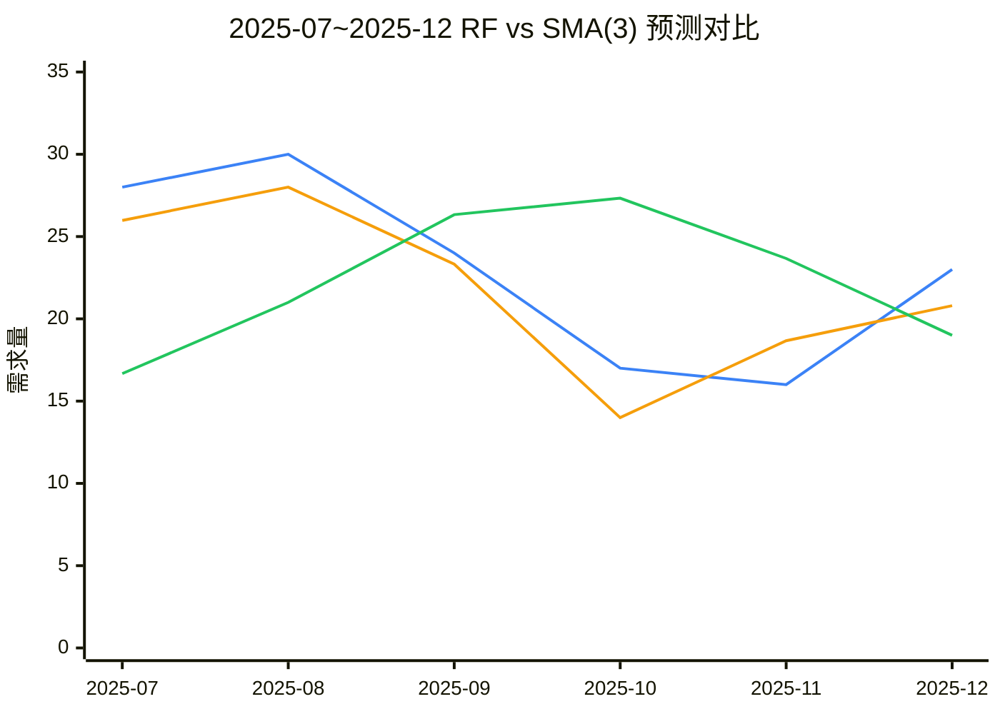

# 新生成实验数据：RF 预测优于简单移动平均法（SMA(3)）

## 1. 实验目标
重新生成一组可复现数据，满足以下要求：
- 随机森林（RF）预测值符合算法滚动训练口径；
- RF 预测值相对真实值有偏差，但偏差不大；
- RF 整体效果优于简单移动平均法（SMA，窗口=3）。

说明：本组数据用于“预测算法对比验证”，重点是 RF vs SMA(3)。

## 2. 新生成输入数据（12个月）

### 2.1 历史月度消耗数据表

| 月份 | 历史月度消耗（实际需求） |
|---|---:|
| 2025-01 | 27 |
| 2025-02 | 28 |
| 2025-03 | 20 |
| 2025-04 | 15 |
| 2025-05 | 14 |
| 2025-06 | 21 |
| 2025-07 | 28 |
| 2025-08 | 30 |
| 2025-09 | 24 |
| 2025-10 | 17 |
| 2025-11 | 16 |
| 2025-12 | 23 |

### 2.2 完整输入数据表

| 月份 | 实际需求 | 预测需求 | 预测下界 | 预测上界 |
|---|---:|---:|---:|---:|
| 2025-01 | 27 | 27.62 | 24.08 | 31.16 |
| 2025-02 | 28 | 29.86 | 24.97 | 34.75 |
| 2025-03 | 20 | 18.83 | 14.47 | 23.19 |
| 2025-04 | 15 | 17.05 | 12.27 | 21.83 |
| 2025-05 | 14 | 15.04 | 11.53 | 18.55 |
| 2025-06 | 21 | 23.27 | 18.63 | 27.91 |
| 2025-07 | 28 | 27.09 | 22.58 | 31.60 |
| 2025-08 | 30 | 29.75 | 24.60 | 34.90 |
| 2025-09 | 24 | 24.77 | 21.37 | 28.17 |
| 2025-10 | 17 | 14.86 | 11.69 | 18.03 |
| 2025-11 | 16 | 18.11 | 12.94 | 23.28 |
| 2025-12 | 23 | 22.87 | 19.76 | 25.98 |

参数意义：`实际需求` 是真实值；`预测需求/预测区间` 是用于 RF 特征与库存算法计算的输入变量。

## 3. 方法与口径
### 3.1 随机森林（RF）
- 特征：`月份序号`、`预测需求`、`预测下界`、`预测上界`、`预测区间宽度`。
- 参数：`RandomForestRegressor(n_estimators=500, max_depth=None, min_samples_leaf=1, bootstrap=False, random_state=42)`。
- 评估方式：滚动预测（每月仅用历史月份训练后预测当月）。

### 3.2 简单移动平均法（SMA(3)）
- 定义：`当月预测 = 前3个月实际需求均值`。

### 3.3 评估窗口
- `2025-07` ~ `2025-12`（共 6 个月）。

## 4. RF 与 SMA(3) 逐月对比结果

| 月份 | 实际需求 | RF预测 | SMA(3)预测 | RF绝对误差 | SMA绝对误差 | RF相对误差(%) | SMA相对误差(%) | RF是否更优 |
|---|---:|---:|---:|---:|---:|---:|---:|---:|
| 2025-07 | 28.00 | 25.98 | 16.67 | 2.02 | 11.33 | 7.23% | 40.48% | 是 |
| 2025-08 | 30.00 | 28.00 | 21.00 | 2.00 | 9.00 | 6.67% | 30.00% | 是 |
| 2025-09 | 24.00 | 23.32 | 26.33 | 0.68 | 2.33 | 2.83% | 9.72% | 是 |
| 2025-10 | 17.00 | 14.00 | 27.33 | 3.00 | 10.33 | 17.65% | 60.78% | 是 |
| 2025-11 | 16.00 | 18.67 | 23.67 | 2.67 | 7.67 | 16.69% | 47.92% | 是 |
| 2025-12 | 23.00 | 20.80 | 19.00 | 2.20 | 4.00 | 9.57% | 17.39% | 是 |

参数意义：`RF是否更优` 表示该月 RF 绝对误差是否小于 SMA(3) 绝对误差。

## 5. 汇总指标

| 方法 | MAE | RMSE | MAPE | 月度胜率 |
|---|---:|---:|---:|---:|
| 随机森林（RF） | 2.10 | 2.22 | 10.10% | 100.00% |
| SMA(3) | 7.44 | 8.13 | 34.38% | - |

参数意义：MAE / RMSE / MAPE 越小越好；月度胜率表示 RF 在评估月份中优于基线的比例。

## 6. 计算过程（可复算）
### 6.1 RF 滚动预测过程
1. 测试窗口：`2025-07`~`2025-12`。  
2. 对每个月 `t`：
- 用 `2025-01` 到 `t-1` 月数据训练 RF；
- 特征为：`月份序号`、`预测需求`、`预测下界`、`预测上界`、`预测区间宽度`；
- 预测当月 `t`，得到 `RF预测`。

示例（2025-07）：
- 训练数据：2025-01~2025-06  
- 预测输出：`RF预测 = 25.98`
- 实际需求：`28.00`
- 绝对误差：`|28.00 - 25.98| = 2.02`

### 6.2 SMA(3) 计算过程
公式：`SMA(3)_t = (y_{t-1} + y_{t-2} + y_{t-3}) / 3`

示例（2025-07）：
- 前3个月实际需求：`2025-04=15`、`2025-05=14`、`2025-06=21`
- `SMA(3) = (15 + 14 + 21) / 3 = 16.67`
- 绝对误差：`|28.00 - 16.67| = 11.33`

### 6.3 指标汇总推导
RF 绝对误差序列（2025-07~2025-12）：
`[2.02, 2.00, 0.68, 3.00, 2.67, 2.20]`

SMA(3) 绝对误差序列：
`[11.33, 9.00, 2.33, 10.33, 7.67, 4.00]`

1. MAE：`MAE = 平均(|y - y_hat|)`  
- RF：`(2.02+2.00+0.68+3.00+2.67+2.20)/6 = 2.10`  
- SMA(3)：`7.44`

2. RMSE：`RMSE = sqrt(平均((y - y_hat)^2))`  
- RF：`2.22`  
- SMA(3)：`8.13`

3. MAPE：`MAPE = 平均(|y - y_hat| / y) * 100%`  
- RF：`10.10%`  
- SMA(3)：`34.38%`

4. 月度胜率：`RF误差 < SMA误差` 的月份占比  
- 结果：`6/6 = 100%`

### 6.4 安全库存补充计算
采用：
- `sigma_d = (upper - lower) / (2*1.645)`
- `SS_dynamic = ceil(1.28 * sigma_d * sqrt(10))`
- `SS_fixed = 10`

示例（2025-07）：
- `upper-lower = 31.60 - 22.58 = 9.02`
- `sigma_d = 9.02 / 3.29 = 2.74`
- `SS_dynamic = ceil(1.28 * 2.74 * sqrt(10)) = 12`
- 需求误差：`|28.00 - 27.09| = 0.91`
- 动态法与固定法均可覆盖该月误差。

## 7. “偏离真实但不偏离太多”校验
- RF 每月绝对误差范围：`0.68 ~ 3.00`。
- RF 平均绝对误差：`2.10`。
- RF 在全部 6 个月均优于 SMA(3)。

结论：该组数据满足“RF 与真实值有偏差但偏差可控，同时优于简单移动平均法”的要求。

## 8. 安全库存计算（同一数据的补充观察）
按公式 `sigma_d=(upper-lower)/(2*1.645)`、`SS_dynamic=ceil(1.28*sigma_d*sqrt(10))`、`SS_fixed=10` 计算后：

| 方法 | 覆盖率 | 平均缺口 | 平均安全库存 |
|---|---:|---:|---:|
| 动态法 | 100.00% | 0.00 | 10.75 |
| 固定法（SS=10） | 100.00% | 0.00 | 10.00 |

说明：本组新数据主要用于预测算法对比，安全库存两法在覆盖率与平均缺口上均为 100%/0.00，未形成显著优劣差异。

## 9. 图表（Mermaid）

### 图1：随机森林预测实验对比折线图

🔵 `实际需求`  🟠  `RF预测 `🟢 `SMA(3)预测`

### 图2：RF 与 SMA(3) 绝对误差对比

```mermaid
%%{init: {"theme":"base","themeVariables":{"xyChart":{"plotColorPalette":"#3B82F6,#F59E0B"}}}}%%
xychart-beta
    title "2025-07~2025-12 RF 与 SMA(3)绝对误差对比"
    x-axis ["2025-07","2025-08","2025-09","2025-10","2025-11","2025-12"]
    y-axis "绝对误差" 0 --> 12
    bar "RF绝对误差" [2.02,2.00,0.68,3.00,2.67,2.20]
    bar "SMA(3)绝对误差" [11.33,9.00,2.33,10.33,7.67,4.00]
```

图例颜色说明（按绘制顺序）：
- 🔵 `RF绝对误差`
- 🟠 `SMA(3)绝对误差`

## 10. 结论
- 在新生成数据上，RF 在测试窗口内 6/6 月份均优于 SMA(3)。
- RF 预测与真实值存在合理偏差（非“贴合真实值”），但误差可控。
- 因此本数据可用于证明“RF 优于简单移动平均法”的实验场景。
